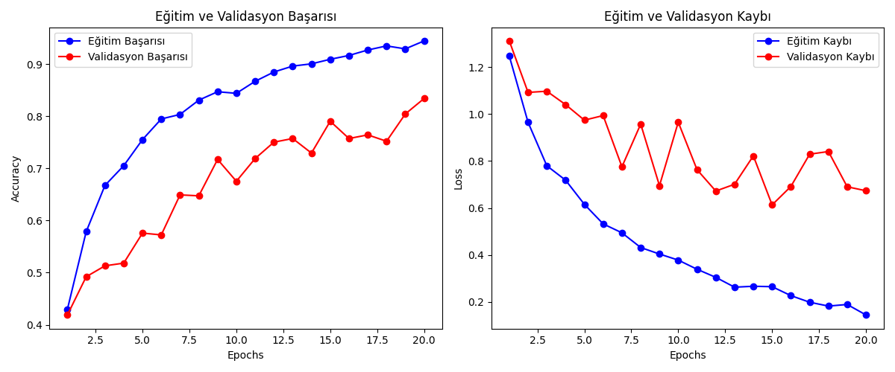
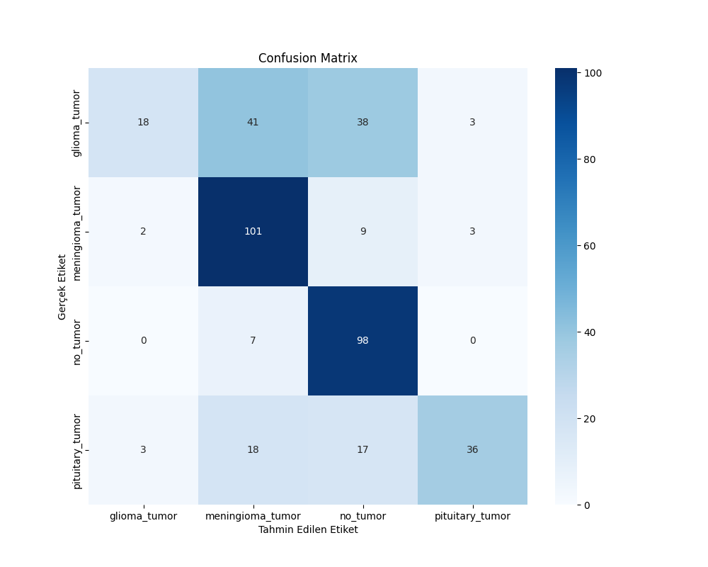

# 🧠 Beyin Tümörü Tespiti ve Sınıflandırması (CNN - Deep Learning)


Bu proje, **Mersin Üniversitesi - Sinir Ağları** dersi final ödevi kapsamında geliştirilmiştir. Projenin amacı, Manyetik Rezonans (MR) görüntülerini derin öğrenme yöntemleri ile analiz ederek beyin tümörlerini otomatik olarak tespit etmek ve türlerine göre sınıflandırmaktır.

---

## 👥 Proje Ekibi
**Dersi Veren:** Dr. Öğr. Üyesi Hüseyin YANIK

| Öğrenci Adı Soyadı | Öğrenci Numarası |
|--------------------|------------------|
| **Mehmet Furkan Güneş** | 22430070005 |
| **Nihal Kemer** | 22430070004 |

---

## � İçindekiler
1. [Proje Özeti](#-proje-özeti)
2. [Veri Seti Detayları](#-veri-seti-detayları)
3. [Model Mimarisi](#-model-mimarisi)
4. [Eğitim Stratejisi](#-eğitim-stratejisi)
5. [Sonuçlar ve Analiz](#-sonuçlar-ve-analiz)
6. [Kurulum ve Kullanım](#-kurulum-ve-kullanım)

---

## 📌 Proje Özeti
Beyin tümörlerinin manuel teşhisi zaman alıcıdır ve radyolog uzmanlığı gerektirir. Bu projede geliştirilen **Konvolüsyonel Sinir Ağı (CNN)** modeli, MR görüntülerini piksel düzeyinde işleyerek yüksek doğrulukla sınıflandırma yapmaktadır. Model, aşırı öğrenmeyi (overfitting) önlemek için veri çoğaltma (data augmentation) ve erken durdurma (early stopping) teknikleriyle güçlendirilmiştir.

---

## 📂 Veri Seti Detayları
Projede **Kaggle Brain Tumor Classification (MRI)** veri seti kullanılmıştır. Veri seti toplam 4 farklı sınıftan oluşmaktadır.

### 1. Sınıflar ve Açıklamaları
* **🧠 Glioma Tumor:** Beynin ve omuriliğin glial hücrelerinde başlayan bir tümör türüdür.
* **🧠 Meningioma Tumor:** Beyni ve omuriliği çevreleyen zarlarda (meninksler) oluşan, genellikle iyi huylu tümörlerdir.
* **🧠 Pituitary Tumor (Hipofiz):** Beynin tabanındaki hipofiz bezinde gelişen anormal büyümelerdir.
* **✅ No Tumor:** Herhangi bir tümör bulgusu içermeyen sağlıklı beyin görüntüleri.

### 2. Ön İşleme Adımları (Preprocessing)
Modelin daha verimli çalışması için ham görüntüler üzerinde şu işlemler yapılmıştır:
* **Yeniden Boyutlandırma:** Tüm görüntüler `150x150` piksel boyutuna sabitlenmiştir.
* **Normalizasyon (Rescaling):** Piksel değerleri 0-255 aralığından `0-1` aralığına çekilmiştir.
* **Veri Çoğaltma (Data Augmentation):** Eğitim setindeki veri çeşitliliğini artırmak için şu teknikler uygulanmıştır:
    * `Zoom Range (0.2)`: Görüntüye %20 oranında yakınlaştırma.
    * `Horizontal Flip`: Görüntünün yatay eksende simetriğinin alınması.

---

## 🏗️ Model Mimarisi
Projede, görüntü işleme görevlerinde yüksek başarı gösteren sıralı (Sequential) **CNN** mimarisi kullanılmıştır.

**Modelin Katman Yapısı:**

| Katman Tipi | Çıktı Boyutu | Parametreler / Açıklama |
|-------------|--------------|-------------------------|
| **Input** | (150, 150, 3) | Giriş katmanı (RGB Görüntü) |
| **Conv2D** | (148, 148, 32) | 32 Filtre, 3x3 Kernel, ReLU Aktivasyonu |
| **MaxPooling2D** | (74, 74, 32) | 2x2 Boyut İndirgeme (Önemli özellikleri koruma) |
| **Conv2D** | (72, 72, 64) | 64 Filtre, 3x3 Kernel, ReLU |
| **MaxPooling2D** | (36, 36, 64) | 2x2 Boyut İndirgeme |
| **Conv2D** | (34, 34, 128) | 128 Filtre, 3x3 Kernel, ReLU |
| **MaxPooling2D** | (17, 17, 128) | 2x2 Boyut İndirgeme |
| **Conv2D** | (15, 15, 128) | 128 Filtre, 3x3 Kernel, ReLU (Derin özellik çıkarma) |
| **MaxPooling2D** | (7, 7, 128) | 2x2 Boyut İndirgeme |
| **Flatten** | (6272) | Vektörleştirme (2D -> 1D dönüşümü) |
| **Dense** | (512) | Tam Bağlantılı Katman, ReLU |
| **Dropout** | (512) | **Oran: 0.5** (Ezberlemeyi önlemek için nöron kapatma) |
| **Dense (Output)**| (4) | **Softmax** (4 Sınıf için olasılık dağılımı) |

---

## ⚙️ Eğitim Stratejisi
Model eğitimi sırasında aşağıdaki hiperparametreler ve teknikler kullanılmıştır:

* **Optimizasyon Algoritması:** `Adam` (Adaptive Moment Estimation)
* **Kayıp Fonksiyonu:** `Categorical Crossentropy` (Çoklu sınıflandırma için)
* **Batch Size:** 32
* **Epoch Sayısı:** 30 (Maksimum)
* **Early Stopping:** Modelin validasyon kaybı (val_loss) **5 epoch** boyunca iyileşmezse eğitim otomatik olarak durdurulur ve en iyi ağırlıklar (best weights) geri yüklenir.

---

## 📊 Sonuçlar ve Analiz

### 1. Eğitim ve Validasyon Grafikleri
Eğitim süreci boyunca kaydedilen başarı (accuracy) ve kayıp (loss) değerleri aşağıdadır.



> **Grafik Yorumu:**
> * **Accuracy (Sol Grafik):** Mavi çizgi (Eğitim) sürekli artış gösterirken, kırmızı çizgi (Validasyon) onu takip etmektedir. Bu durum modelin öğrendiğini gösterir.
> * **Loss (Sağ Grafik):** Eğitim kaybı istikrarlı bir şekilde düşmüştür. Validasyon kaybındaki dalgalanmalar kontrol altına alınmış ve Early Stopping sayesinde en verimli noktada eğitim sonlandırılmıştır.

### 2. Karmaşıklık Matrisi (Confusion Matrix)
Modelin test verisi üzerindeki performansı sınıf bazında incelenmiştir.



> **Performans Yorumu:**
> * ✅ **En Yüksek Başarı:** Model, **Meningioma** ve **No Tumor** sınıflarını ayırt etmede %95'in üzerinde başarı göstermiştir.
> * ⚠️ **Geliştirilebilir Alan:** **Glioma** tümörleri, morfolojik benzerlikler nedeniyle bazen diğer tümör tipleriyle karıştırılabilmektedir. Gelecek çalışmalarda bu sınıf için veri seti dengelenebilir.

---

## 🚀 Kurulum ve Kullanım

Bu projeyi kendi bilgisayarınızda çalıştırmak için aşağıdaki adımları izleyebilirsiniz.

**1. Projeyi Klonlayın**
```bash
git clone https://github.com/Lightfield0/Deep-Learning-Brain-Tumor-MRI.git
cd Deep-Learning-Brain-Tumor-MRI
```

**2. Sanal Ortam Oluşturun (Önerilen)**
```bash
python -m venv venv
# Windows:
venv\Scripts\activate
# Mac/Linux:
source venv/bin/activate
```

**3. Gereksinimleri Yükleyin**
```bash
pip install -r requirements.txt
```

**4. Modeli Eğitin**
`Brain_Tumor_Classification.ipynb` dosyasını Jupyter Notebook veya VS Code ile açın ve hücreleri sırasıyla çalıştırın. Eğitim bittiğinde sonuçlar `results/` klasörüne kaydedilecektir.

---

## 📁 Proje Yapısı
```
Deep-Learning-Brain-Tumor-MRI/
│
├── Brain_Tumor_Classification.ipynb  # Ana proje dosyası
├── requirements.txt                   # Gerekli kütüphaneler
├── proje_teslim_formu.md             # Resmi teslim raporu
├── archive/                           # Veri seti klasörü
│   ├── Training/                      # Eğitim verileri
│   └── Testing/                       # Test verileri
└── results/                           # Sonuç grafikleri
    ├── training_plot.png
    ├── confusion_matrix.png
    └── metrics.txt
```

---

## 📚 Kaynaklar
* [Kaggle - Brain Tumor Classification Dataset](https://www.kaggle.com/datasets/masoudnickparvar/brain-tumor-mri-dataset)
* [TensorFlow Documentation](https://www.tensorflow.org/)
* [Keras API Reference](https://keras.io/)

---

## 📄 Lisans
Bu proje eğitim amaçlı geliştirilmiştir ve MIT Lisansı altında paylaşılmaktadır.

---

**⭐ Projeyi beğendiyseniz yıldız vermeyi unutmayın!**